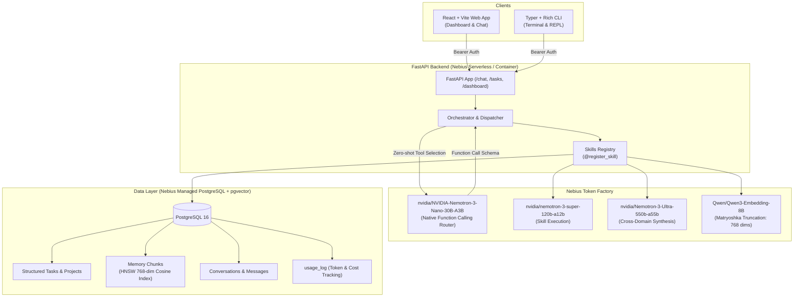

# Compass

Personal AI assistant with persistent memory — tracks hackathon deadlines, recalls code context across repos, and organizes coursework. Built on Nebius Token Factory with Nemotron models. Web chat + CLI, one shared brain.

---

## System Architecture



---

## How Nebius & NVIDIA Power It

Compass is built natively on Nebius Token Factory for low-latency, enterprise-grade model inference across three dedicated tiers:

### 1. NVIDIA Open-Source Models (Core Hackathon Submission)
* **Router & Dispatcher**: `nvidia/NVIDIA-Nemotron-3-Nano-30B-A3B`
  - Evaluates all incoming user messages using native OpenAI-compatible function calling (`tools` + `tool_choice: "auto"`).
  - Dispatches zero-shot to structured task mutations, memory retrieval, or contextual conversation without requiring brittle JSON parsing fallbacks.
* **Skill Execution**: `nvidia/nemotron-3-super-120b-a12b`
  - Drives high-precision domain actions, reasoning over complex schedules, dependencies, and code contexts.
* **Cross-Domain Synthesis**: `nvidia/Nemotron-3-Ultra-550b-a55b`
  - Condenses multi-turn conversations into persistent long-term memory chunks and executes nightly memory consolidation jobs.

### 2. Other Token Factory Models Used
* **Vector Embeddings**: `Qwen/Qwen3-Embedding-8B`
  - Generates semantic embeddings for code, coursework, and memory chunks.
  - Utilizes **Matryoshka representation learning (`dimensions=768`)** to truncate native 4096-dim vectors into high-fidelity 768-dim embeddings, maintaining sub-0.21 cosine distance on target queries while remaining strictly within PostgreSQL `pgvector`'s 2,000-dimension HNSW indexing boundary.

---

## Why Nebius & NVIDIA?

1. **Ultra-Low Latency Function Calling**: `NVIDIA-Nemotron-3-Nano-30B-A3B` hosted on Nebius Token Factory handles routing in under 400ms, making conversational interaction instantaneous.
2. **Matryoshka Truncation without Loss**: Nebius supports the `dimensions=768` parameter on `Qwen3-Embedding-8B`, giving 100% Top-1 retrieval recall across code, hackathon, and coursework queries while fitting within `pgvector`'s high-performance HNSW index.
3. **Co-located VPC Database Performance**: By deploying the FastAPI backend and Nebius Managed PostgreSQL in the same cloud region, query latency to vector and structured memory stays under 3ms.

---

## Getting Started

### Local Setup
```powershell
# 1. Clone & install dependencies
pip install -r backend/requirements.txt
pip install -e ./cli

# 2. Configure environment
cp .env.example .env
# Add your NEBIUS_API_KEY to .env

# 3. Start PostgreSQL and Seed Data
python scripts/seed_data.py

# 4. Start the API server (includes automatic / -> /docs redirect)
uvicorn backend.main:app --reload --port 8000
```

### CLI Usage
```powershell
# Configure CLI endpoint & token
compass config --url http://localhost:8000 --token dev-token

# View tasks, projects, and dashboard
compass tasks
compass tasks --domain hackathon
compass projects
compass status

# One-shot ask
compass ask "What tasks are due this week for Compass?"

# Log context memory
compass log "Integrated 768-dim embeddings" --domain code --project "Compass" --tags nebius,vector
```
