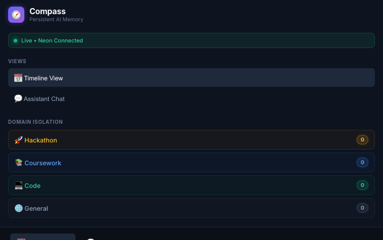
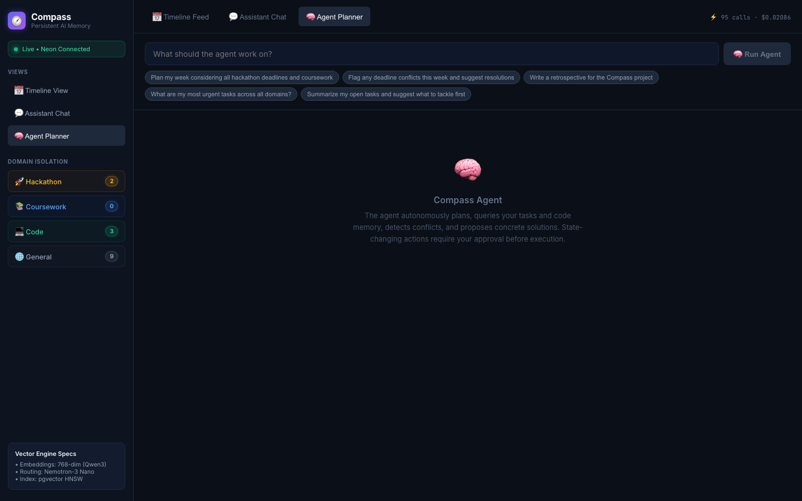
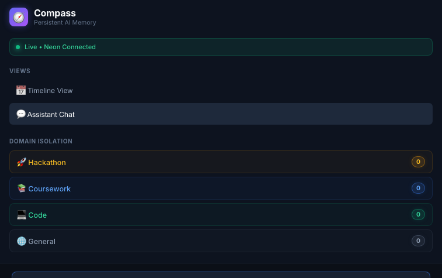
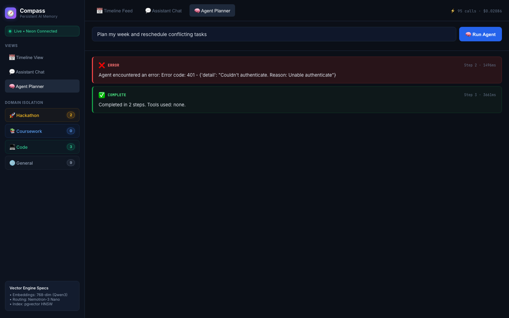
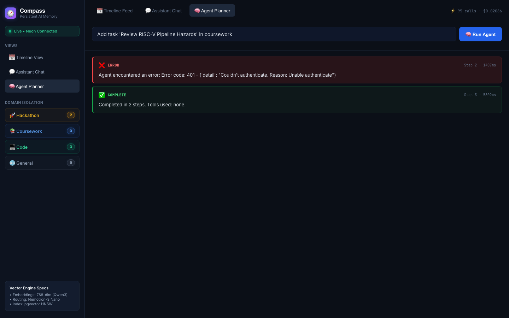

# 🧭 Compass

> **Your one AI that remembers every hackathon, repo, and deadline — so you don't have to.**

[](LICENSE)
[](https://www.python.org/)
[](https://fastapi.tiangolo.com/)
[](https://react.dev/)
[](https://github.com/Ratnesh-101/compass/actions/workflows/ci.yml)
[](https://build.nvidia.com/)
[](https://neon.tech/)
[](https://tavily.com/)
[](https://compass-farmlytics.vercel.app)

Compass is a persistent-memory AI copilot that connects your tasks, hackathon deadlines, coursework, code context, and conversations into one agent-driven workspace. It reasons across all of them — and asks before changing anything.

**[🌐 Live Dashboard](https://compass-farmlytics.vercel.app)** · **[🔌 API Health](https://compass-backend-qryu.onrender.com/health)** · **[🎥 Demo Video Script](./SUBMISSION_KIT.md#video-script)**

---

## Why Compass?

Most tools solve one context well. None of them talk to each other.

| Tool | What it handles | What it misses |
|------|----------------|----------------|
| ChatGPT / Claude | Current conversation | Remembers nothing next session |
| Notion / Linear | Tasks and projects | Can't reason across domains or run autonomously |
| Google Calendar | Time | No understanding of technical load or code context |
| GitHub | Code history | Unaware of your deadlines or coursework |

**Compass connects these contexts through persistent memory and an autonomous agent.** When you ask *"What should I work on tonight given my hackathon deadline and unfinished deployment?"*, Compass queries your tasks, recalls relevant code context, checks calendar capacity, and reasons across all of it — without you switching tabs or copying context.

---

## What Compass Does

### Example Workflow

You have a hackathon submission on Friday, a DLD assignment tomorrow, and your backend still needs deployment. You ask:

> *"I have 5 days and 4 hours a day. Go through everything I have open across the hackathon, my coursework, and my code debt, and tell me honestly whether I can finish it."*

Compass:
1. Queries all open tasks across `hackathon`, `coursework`, and `code` domains
2. Retrieves relevant code context from vector memory (architecture decisions, deployment notes)
3. Runs the **feasibility engine** — computes demand vs. effective capacity with a configurable safety margin
4. Returns: *"Infeasible. Demand: 31.4h, Effective Capacity: 4.0h (80% safety margin on 5.0h nominal). Here's a triage plan: keep 2 critical items, defer 8, drop 2."*
5. Proposes a replan — and **does not touch the database until you approve**

---

## See It In Action

| Timeline Feed | Northstar AI Workspace |
|:---:|:---:|
|  |  |

| Chat Copilot with Memory | Specialist Agents |
|:---:|:---:|
|  |  |

| Agent Confirmation Gate — Pending | Agent Confirmation Gate — After Approval |
|:---:|:---:|
|  |  |

---

## Key Features

| | Feature | What it does |
|--|---------|-------------|
| 🧠 | **Persistent Cross-Domain Memory** | Tasks, conversations, code context, and web research stored in PostgreSQL + pgvector and recalled across sessions |
| 🤖 | **Autonomous ReAct Agent** | Multi-step planning loop (Northstar) that reasons, calls tools, and synthesizes results — stopping at a confirmation gate before any database write |
| 🧩 | **Specialist Delegation** | Four domain agents (Coursework, Research, Calendar, Memory) that Northstar delegates to for focused analysis |
| 🌐 | **Live Web Intelligence** | Three Tavily-powered tools: `search_web` (grounded answers), `ingest_url` (confirm-gated web-to-memory ingestion), `verify_deadline` (staleness detection against live sources) |
| 📊 | **Feasibility Engine** | Deterministic capacity arithmetic — computes demand vs. available hours and produces a triage plan without trusting the LLM to do the math |
| 📅 | **Calendar Integration** | Google Calendar OAuth sync, deterministic slot allocation, ICS generation, conflict detection |
| 💬 | **Chat Session Management** | Auto-named chats, pin/archive/rename, cross-session memory continuity, 1-click public share links |
| ↩️ | **Audit & Undo** | Every agent mutation logged to `agent_audit_log` with per-action 1-click rollback |
| 💻 | **Terminal CLI** | Full `compass` CLI built with Typer + Rich — `status`, `ask`, `agent`, `add`, `log`, and more |
| 🔒 | **Human Confirmation Gates** | State-mutating tools (`add_task`, `edit_task`, `delete_task`, `apply_triage_plan`, `ingest_url`) halt and request explicit approval before execution |

---

## Architecture

```
User (Web or CLI)
        │
        ▼
Northstar AI (Chat Copilot / Goal Planner / Specialist Agents)
        │
        ▼
Nemotron-3 Nano 30B — intent routing & tool selection
        │
    ┌───┴──────────────────┐
    │                       │
    ▼                       ▼
Skill Handlers        Specialist Team
(tasks, memory,       (Coursework, Research,
 web, calendar)        Calendar, Memory)
    │
    ▼
Nemotron-3 Super 120B — complex reasoning
    │
    ▼
Confirmation Gate ← Human approves/rejects
    │
    ▼
Database Write + Audit Log
    │
    ▼
Nemotron-3 Ultra 550B — cross-domain synthesis
(invoked only for summarize_across_domains)
```

For the full system diagram, request flow, memory schema, and deployment details: **[docs/architecture.md](docs/architecture.md)**

---

## AI Model Architecture

Compass routes every request through a cost-efficient 3-tier model hierarchy on **Nebius Token Factory**:

| Model | Role | When invoked |
|-------|------|-------------|
| `NVIDIA-Nemotron-3-Nano-30B-A3B` | Intent router | Every message — selects tool or chat |
| `nemotron-3-super-120b-a12b` | Skill reasoning | Multi-step tasks, agent loops |
| `Nemotron-3-Ultra-550b-a55b` | Cross-domain synthesis | `summarize_across_domains` only |
| `Qwen/Qwen3-Embedding-8B` | 768-dim vector embeddings | Code, notes, ingested web docs |

**Token Economics** (measured across 106 internal evaluation turns): total spend was $0.019 on Nebius Token Factory. Over 85% of queries were resolved by Nano and direct PostgreSQL queries without escalating to larger models.

> Note: Model cost rates are from Nebius Token Factory pricing. The $0.019 measurement reflects internal testing volume, not a production-scale benchmark.

---

## Web Intelligence (Tavily)

Three specialized Tavily tools, each with distinct behavior:

**`search_web`** — Real-time grounded answers. When Compass has no memory coverage, the model emits `[ABSTAIN]` instead of hallucinating. The agent loop intercepts this, forces a Tavily search, and fences the web content in `<untrusted_web_content>` tags before passing it to the model — preventing indirect prompt injection.

**`ingest_url`** — Confirm-gated web-to-memory pipeline. Tavily Extract fetches and cleans the page, content is chunked (~1,200 chars), embedded via Qwen3-Embedding-8B into 768-dim vectors, and stored in Neon pgvector. Requires explicit user confirmation before any write. Fully reversible via `/api/agent/undo`.

**`verify_deadline`** — Proactive staleness detection. Cross-references stored task deadlines against live contest/course websites to detect drift. Does not modify the database.

---

## Interfaces

### Web Dashboard

Live at [compass-farmlytics.vercel.app](https://compass-farmlytics.vercel.app) — anonymous demo access, no login required.

- **Timeline** — task and deadline feed across all domains, filterable by Hackathon / Coursework / Code / General
- **Northstar AI** — primary workspace with Chat Copilot, Goal Planner, and Specialist Agents tabs
- **Schedule** — calendar view with Google Calendar sync
- Real-time SSE streaming for agent execution traces
- Color-coded step cards: `THINK`, `TOOL CALL`, `RESULT`, `CONFIRMATION REQUIRED`, `SYNTHESIS`
- One-click Approve / Reject on mutation proposals
- Public share links for any conversation (`/?share=<id>`)

### Terminal CLI

```bash
pip install -e ./cli

# Dashboard overview
compass status

# Ask a question
compass ask "What are my open hackathon tasks due this week?"

# Add a task
compass add "Finalize backend deployment" --domain hackathon --due 2026-10-30 --priority urgent

# Log code context (gets embedded into vector memory)
compass log "Switched to 768-dim Matryoshka truncation for pgvector HNSW" --domain code

# Launch the autonomous planning agent
compass agent "Plan my week given all deadlines and coursework"

# View token usage and estimated API costs
compass admin usage
```

---

## Tech Stack

| Layer | Technology | Host |
|-------|-----------|------|
| Frontend | React 18 + Vite + Vanilla CSS | Vercel |
| Reverse Proxy | Vercel edge rewrites | Vercel |
| Backend API | FastAPI + Uvicorn, Python 3.12 | Render |
| Database | PostgreSQL 16 + pgvector (HNSW) | Neon Cloud |
| Intent Routing | Nemotron-3 Nano 30B | Nebius Token Factory |
| Skill Reasoning | Nemotron-3 Super 120B | Nebius Token Factory |
| Cross-Domain Synthesis | Nemotron-3 Ultra 550B | Nebius Token Factory |
| Vector Embeddings | Qwen3-Embedding-8B (768-dim) | Nebius Token Factory |
| Web Intelligence | Tavily Async API | Tavily |
| Streaming | Server-Sent Events (SSE) | FastAPI StreamingResponse |
| Cloud Manifests | Serverless Endpoint + Cron Job | Nebius AI Cloud (deploy-ready) |

---

## Quick Start

### Prerequisites

- Python 3.12+
- Node.js 18+ and npm
- PostgreSQL 16 with `pgvector` (or a free [Neon](https://neon.tech) connection string)
- [Nebius Token Factory](https://nebius.com/) API key
- [Tavily](https://tavily.com/) API key (optional — disables web tools if omitted)

### Setup

```bash
git clone https://github.com/Ratnesh-101/compass.git
cd compass

# Copy and fill in your environment variables
cp .env.example .env
# Edit .env: set NEBIUS_API_KEY, AUTH_TOKEN, DATABASE_URL

# Install backend dependencies
pip install -r backend/requirements.txt

# Install CLI
pip install -e ./cli
```

### Run

**One-command launch:**

```bash
# Windows
run_local.bat

# Linux / macOS
chmod +x run_local.sh && ./run_local.sh

# Docker Compose (full stack with local PostgreSQL + pgvector)
docker compose up
```

**Manual (two terminals):**

```bash
# Terminal 1 — Backend
python -m uvicorn backend.main:app --port 8000 --reload

# Terminal 2 — Frontend
cd frontend && npm install && npm run dev
```

Open [http://localhost:5173](http://localhost:5173). All visitors receive an isolated anonymous workspace.

---

## Testing

Compass has **195 automated tests** (verified by pytest collection across 20 test suites including security hardening) against a live PostgreSQL + pgvector instance.

```bash
# Set a test database first
export TEST_DATABASE_URL="postgresql://..."
python -m pytest tests -v
```

Tests cover: agent execution, API endpoints, authentication, memory, scheduling, calendar OAuth, Tavily/web research, CLI, SSE streaming, user isolation, specialist agents, feasibility engine, and end-to-end flows.

See **[docs/testing.md](docs/testing.md)** for per-file breakdown and test infrastructure notes.

---

## Deployment

Compass uses GitHub Actions for continuous integration and provider-native continuous delivery. Merges to the `main` branch target automated deployment via Vercel (frontend) and Render (backend), with post-deployment health verification performed via `scripts/verify_deployment.py`.

See **[docs/deployment.md](docs/deployment.md)** for full architecture, environment variables, verification, and rollback runbooks.

---

## Project Structure

```
compass/
├── backend/
│   ├── agent.py          # ReAct agent loop
│   ├── orchestrator.py   # Skill dispatch and execution
│   ├── router.py         # Nemotron-3 Nano intent routing
│   ├── agents/
│   │   ├── specialist.py # Specialist multi-agent system
│   │   └── feasibility.py# Deterministic capacity engine
│   ├── memory/
│   │   ├── db.py         # Pool lifecycle + auto-migration
│   │   ├── structured.py # SQL task/conversation queries
│   │   ├── vector.py     # pgvector HNSW search
│   │   └── schema.sql    # Full database schema
│   ├── services/
│   │   ├── tavily.py     # Tavily integration
│   │   ├── calendar.py   # Google Calendar service
│   │   ├── embeddings.py # Qwen embedding calls
│   │   └── scheduler.py  # Slot allocation engine
│   └── skills/           # Tool definitions and handlers
├── frontend/src/
│   ├── components/
│   │   ├── ChatPanel.jsx      # Chat Copilot UI
│   │   ├── AgentPanel.jsx     # Goal Planner / agent trace
│   │   ├── SpecialistPanel.jsx# Specialist Agents UI
│   │   ├── Timeline.jsx       # Task/deadline feed
│   │   └── CalendarView.jsx   # Schedule + Google sync
│   └── App.jsx
├── cli/
│   └── assistant_cli.py  # Typer + Rich terminal interface
├── tests/                # 154 automated tests (pytest-asyncio)
├── deploy/               # Nebius AI Cloud manifests
├── docs/                 # Architecture and testing docs
├── docker-compose.yml
├── vercel.json           # Same-origin proxy rewrites
└── .env.example
```

---

## Documentation

- **[Architecture](docs/architecture.md)** — System diagram, request flow, memory schema, deployment, security notes
- **[Deployment](docs/deployment.md)** — CI/CD architecture, environment matrix, verification script, and rollback procedures
- **[Security](docs/security.md)** — Threat model, security controls, SSRF protections, and IDOR isolation
- **[Testing](docs/testing.md)** — Test coverage breakdown, infrastructure, and how to run
- **[API Contract](docs/api_contract.md)** — Endpoint reference
- **[Demo Script](docs/demo_script.md)** — Video walkthrough script and recording checklist
- **[Submission Kit](SUBMISSION_KIT.md)** — Hackathon submission details, Tavily justification, benchmarks

---

## Hackathon Submission

**Track**: Best Apps and Agents — Nebius × NVIDIA Global AI Hackathon 2026

**Bonus categories**:
- *Best Use of Tavily ($3,000)* — three specialized tools with principled epistemic abstention, injection fencing, and confirm-gated persistent memory
- *Most Valuable Feedback Award* — developer experience feedback in `SUBMISSION_KIT.md`

**Timeline**: Repository created September 4, 2026 (after August 26, 2026 launch). Full submission details: [SUBMISSION_KIT.md](SUBMISSION_KIT.md)

---

## Team

| Member | Role |
|--------|------|
| **Rhythm** | Backend architecture, database schema, Nebius Token Factory tool registration |
| **Nandani** | Frontend web dashboard, real-time context stream UI, chat interface |
| **Kunal** | Frontend UI contributions (timeline modernization, UI components) |
| **Ratnesh Singh** | System integration, deployment engineering (Render, Vercel, Nebius manifests), terminal CLI |

---

## License

[MIT](LICENSE)
